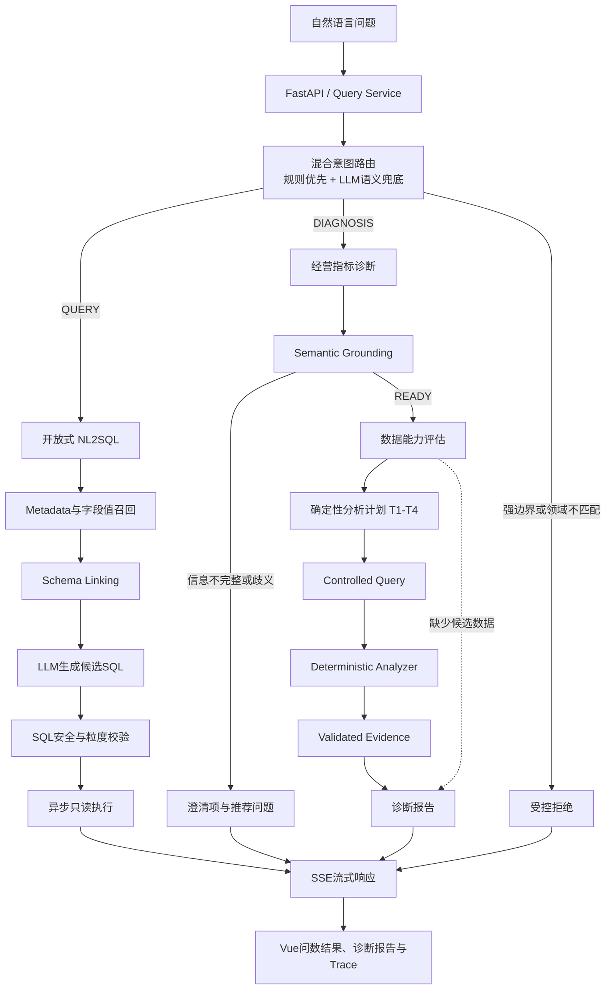
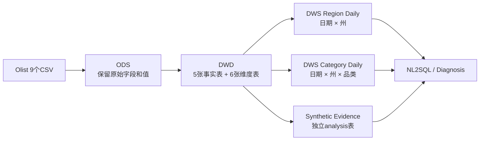

# NL2SQL 经营指标异动诊断 Agent

> 基于 LangGraph 构建的单轮数据分析 Agent：开放式问题通过受控 NL2SQL 查询，
> GMV 异动问题通过确定性分析任务、受控 SQL、数学对账和 Validated Evidence
> 生成可追溯诊断报告。

这个项目不只是把自然语言翻译成 SQL。它从 Olist 原始数据构建 ODS、DWD 和
DWS 数仓，在统一指标口径与 Metadata Catalog 的基础上，为用户提供两类能力：

- **开放问数**：回答“2018 年 5 月 GMV 是多少”“各州销售额排名”等问题；
- **异动诊断**：回答“为什么 2018 年 5 月 GMV 下降”，并说明订单量、AOV、
  地区、品类以及候选经营因素发生了什么变化。

V1 的诊断结论是基于数据证据的**关联分析**，不是严格因果推断。没有数据时，
系统会澄清、降级或拒绝，不让大模型编造原因。

## 核心特点

- 从9个 Olist CSV、约155万行原始数据构建可审计的 ODS→DWD→DWS 数据链路；
- 使用规则优先、LLM 语义兜底的混合意图路由，区分 QUERY、DIAGNOSIS 与
  UNSUPPORTED；
- 使用 BGE、Qdrant、Elasticsearch 和 MySQL Metadata 完成字段、指标、字段值召回
  与 Schema Linking；
- 使用 SQLGlot、Schema 白名单、粒度规则和 MySQL EXPLAIN 校验候选 SQL；
- 使用结构化 AnalysisTask、Controlled Query 和确定性 Analyzer 完成 GMV 拆解；
- 报告只消费 Validated Evidence，每个数字与结论都保留查询和指标版本血缘；
- 使用 FastAPI、SSE 与 Vue 3 实时展示进度、问数结果、诊断报告和安全 Trace。

## 系统架构



这套架构把职责分成两类：LLM 负责自然语言理解、歧义分类和开放问数的候选 SQL
生成；指标公式、表字段白名单、SQL 安全、贡献计算、数学对账和 Evidence 校验由
确定性模块负责。

## 数据架构：ODS → DWD → DWS



### ODS：可追溯的原始层

导入器校验数据集版本、文件大小、SHA-256、表头和行数，并记录导入批次。ODS
保留 Olist 源字段和源值，重复导入同一版本时复用成功批次，避免重复写入。

### DWD：标准化明细层

- 事实表：订单、订单项、支付、配送、评价；
- 维度表：日期、客户、商品、品类、卖家、巴西州。

订单项和支付记录都可能对一个订单形成一对多关系。项目通过显式粒度、预聚合和
对账检测避免多表 JOIN 后重复计算 GMV。

### DWS：稳定分析层

- `dws_sales_region_daily`：日期 × 州，用于整体订单量、AOV、地区贡献和候选因素；
- `dws_sales_category_daily`：日期 × 州 × 品类，用于品类贡献和品类内部分析。

V1 冻结的核心口径为：

```text
GMV = SUM(item_sales_amount)
Order Count = COUNT(DISTINCT order_id)
AOV = GMV / Order Count
```

DWS 保存可加总的分子和分母，比率在运行时重新计算。品类订单量只表示包含该品类
的去重订单数，禁止跨品类相加后解释为整体订单量。

真实 Olist 数据不包含完整的 Traffic、Promotion 和 Inventory 证据。项目使用固定
Seed、版本号和内容摘要生成独立 Synthetic Evidence，用于验证完整诊断链路；生成器
不会覆盖 ODS、DWD 或原始 DWS，也不会在运行时把 Ground Truth 当作答案读取。

## 混合意图识别

Intent Router 把请求分成三类：

- `QUERY`：指标查询、排名、趋势、聚合、TopN、同比或环比；
- `DIAGNOSIS`：GMV 原因、拆解、贡献或候选经营因素分析；
- `UNSUPPORTED`：严格因果、预测、自动经营动作、领域不匹配或 V1 不支持的请求。

路由首先执行确定性规则：

1. 拦截“证明库存导致下降”“自动调价”“预测明年”等强边界请求；
2. 根据 Metadata Catalog 中的指标、表和字段别名识别业务领域词；
3. 根据问数操作词、诊断词、候选因素词和 TopN/阈值正则识别高置信度意图；
4. 只有规则无法判断的歧义问题，才允许调用一次结构化 LLM 分类器。

模型输出还要经过置信度和领域边界复核。低置信度、超时、异常、非业务领域 QUERY
或非 GMV DIAGNOSIS 都会失败关闭为 `UNSUPPORTED`，LLM 不能推翻强安全边界。

## 开放式 NL2SQL 链路

```text
关键词抽取与扩展
→ 字段 / 指标 / 字段值三路召回
→ Schema 与召回信息合并
→ 表和指标过滤
→ 时间、字段、指标、JOIN 上下文补全
→ LLM 生成候选 SQL
→ SQL 静态校验与 EXPLAIN
→ 最多一次受限纠错
→ 异步只读执行
```

Qdrant 保存字段描述、字段示例和业务指标的语义向量；Elasticsearch 检索数据库中
存在的真实维度值；MySQL Metadata 补充字段映射、指标口径和 JOIN 关系。最终只向
模型提供当前问题所需的最小化 Schema，减少无关上下文和字段幻觉。

候选 SQL 在执行前必须通过：

- 单条只读查询限制；
- 注册表、字段、别名和 JOIN 关系校验；
- 函数白名单与危险语法检查；
- `SELECT *`、系统表、文件导出和写操作拦截；
- 聚合、窗口 TopN 和整体/品类粒度防护；
- MySQL EXPLAIN 预检查。

## 经营指标诊断链路

### 1. Semantic Grounding

把“销售额”“圣保罗州”“2018年5月相比4月”等表达绑定为规范指标、Scope 和时间。
缺少时间或存在歧义时，在访问诊断数据前返回缺失项、逻辑候选和推荐完整问题。

### 2. Capability Assessment

根据当前数据字段、粒度和质量决定能够开放哪些分析方法。真实 Olist 缺少候选运营
字段时，系统仍可完成拆解与维度贡献，但会关闭对应候选因素验证并在报告中说明。

### 3. Deterministic Planner

V1 最多生成四类有依赖关系的结构化任务：

- T1：期间对比与异常确认；
- T2：`GMV = Order Count × AOV` 两因素拆解；
- T3：地区和品类变化贡献；
- T4：Traffic、Promotion、Inventory 候选因素验证。

当前生产 Graph/API 使用确定性 Planner。仓库中的 `BoundedPlannerPolicy` 与
`AnalysisPlanValidator` 已作为独立组件实现，但尚未接入生产链路，不作为当前在线
能力宣传。

当前 Feature 边界是：`CLARIFY-001` 已将三种绑定结果接入生产单轮 API 与前端；
`PLAN-LLM-001` 已实现可独立调用的 `AnalysisPlanValidator` 与受限规划策略，但
尚未接入生产 Graph/API。

### 4. Controlled Query 与 Analyzer

标准诊断不让 LLM 自由编写 SQL，而是由 Query Builder 根据任务类型、Registry 和
白名单参数生成受控查询。Analyzer 使用 Decimal 精度完成期间变化、Shapley 两因素
拆解、维度贡献和候选比率计算，并要求各项贡献与实际 GMV 变化对账。

### 5. Validated Evidence 与 Report

Evidence Checker 校验异常 Gate、指标版本、Query/Analysis Result 血缘、数据完整性
和声明强度。Report Generator 只能消费 Validated Evidence，不能直接读取原始查询行
自由发挥。没有实验或准实验设计时，只能输出“关联”“候选因素”“变化方向一致”，
禁止使用“导致”“证明”“唯一原因”等确定因果表述。

## API、SSE 与前端

FastAPI 提供单轮 Query API。后端通过 SSE 依次发送意图识别、语义绑定、能力评估、
计划、查询、计算、Evidence 和报告进度，最终发送 QUERY、DIAGNOSIS、CLARIFICATION
或 UNSUPPORTED 终态结果。

Vue 3 前端使用 UTF-8 流式解码和增量缓冲解析 SSE，区分进度事件与终态结果，并以
白名单字段展示 Trace。公开 Trace 不包含 SQL、绑定参数、原始查询行、连接信息或凭据。

## 固定演示问题

```text
2018 年 5 月 GMV 是多少？
2018 年 5 月 GMV 相比 4 月变化了多少？
为什么 2018 年 5 月 GMV 下降？
2018 年 5 月哪些品类和州对 GMV 下降贡献最大？
2018 年 5 月流量、促销和库存分别发生了什么变化？
进一步分析 2018 年 5 月圣保罗州 GMV 下降的原因。
```

还可以使用“为什么 GMV 下降？”演示缺少时间时的澄清响应，或使用 D01/D03/D05
Synthetic 场景演示 Traffic Drop、Promotion End 和 Stockout 的完整证据链。

## 评测与工程状态

| 范围 | 当前结果 | 说明 |
|---|---:|---|
| Python 全量回归 | 338 passed | 当前仓库行为回归 |
| 前端单元测试 | 11 passed | SSE 与 Trace 等 |
| Ruff / mypy | 0 / 0 | 112 个 Python 源文件 |
| 混合意图路由 | 48/48 | 固定路由样本，三类 Recall 均为 1.0，诊断误放行 0 |
| Synthetic 诊断链 | 10/10 | 固定合成场景，不代表生产准确率 |
| 候选因素 Top-3 覆盖 | 10/10 | 固定 Synthetic Ground Truth |
| Numeric Consistency | 10/10 | 拆解、贡献和指标链完成数学对账 |
| Unsupported Claim / 因果越界 | 0 / 0 | 固定诊断回归 |
| Grouped TopN | 4/4 | 固定受控 SQL 场景 |
| NL2SQL Execution Accuracy | 16/30 | 首次真实基线；JOIN、时间与对比仍是主要改进方向 |

Synthetic 指标验证的是固定功能回归，不是生产泛化能力。真实 Qdrant/Elasticsearch
语义召回准确率和真实 LLM Planner 尚未评测，不能用 Stub 契约结果替代。

## 技术栈

- Backend：Python 3.12、FastAPI、LangGraph、LangChain、Pydantic；
- LLM：兼容 OpenAI 协议的模型接口，可配置 DeepSeek 等服务；
- Retrieval：BGE Embedding、Qdrant、Elasticsearch、jieba；
- Data：MySQL、SQLAlchemy Async、asyncmy、SQLGlot；
- Frontend：Vue 3、Vite、SSE；
- Quality：pytest、pytest-asyncio、Ruff、mypy。

## 本地运行

### 前置条件

- Python 3.12；
- Node.js 与 npm；
- MySQL、Qdrant、Elasticsearch、Embedding 和 LLM 服务；
- 本地配置文件 `conf/app_config.yaml`，该文件包含环境连接信息并被 Git 忽略；
- 数据仓库使用隔离库 `data_agent_v1_dw`。

安装项目依赖并准备外部服务后，推荐使用单进程启动器：

```powershell
.\.venv\Scripts\python.exe -m app.scripts.serve
```

启动器构建 Vue 前端，并由 FastAPI 同源托管页面和 `/api/query`。默认访问：

```text
http://127.0.0.1:8000
```

只执行配置预检和前端构建、不启动服务：

```powershell
.\.venv\Scripts\python.exe -m app.scripts.serve --check
```

`GET /api/health/live` 只表示 Web 进程存活，不代表数据库、检索和模型服务全部就绪。
当前启动方式面向本地演示和受控环境，不包含 TLS、反向代理、高可用或生产 SLA。

## 验证命令

```powershell
.\.venv\Scripts\python.exe -m pytest
.\.venv\Scripts\ruff.exe check .
.\.venv\Scripts\mypy.exe app
npm test --prefix frontend
npm run build --prefix frontend
```

普通单元测试使用 Stub、Mock 或受控 Fixture，不要求连接真实外部服务。真实 MySQL、
Qdrant、Elasticsearch、Embedding 和 LLM 集成评测需要单独准备环境。

## 项目目录

```text
app/
├── agent/              LangGraph、NL2SQL节点与运行状态
├── api/                FastAPI路由、Schema与依赖
├── clients/            外部客户端生命周期管理
├── data_foundation/    ODS→DWD→DWS构建与对账
├── data_import/        Olist数据验证和ODS导入
├── diagnosis/          语义绑定、规划、查询、计算、Evidence与报告
├── metadata/           Catalog、Registry、索引与评测
├── nl2sql/             SQL安全策略与NL2SQL评测
├── repositories/       MySQL、Qdrant、Elasticsearch数据访问
├── services/           Query Service应用编排
└── synthetic/          可复现Synthetic Evidence生成

frontend/               Vue 3单轮分析界面
conf/                   非敏感Metadata与SQL策略
data/                   Manifest、Golden Dataset与脱敏评测报告
docs/                   产品、数据、架构、评测设计和Feature报告
specs/                  每个Feature冻结的实施范围
test/                   后端单元、契约、集成与回归测试
```

## 当前边界

V1 支持单轮问数和 GMV 关联诊断，但不支持：

- 依赖历史语义的省略式多轮追问；
- 严格因果推断；
- 自动补货、调价、营销投放等外部写操作；
- 登录、租户、企业权限和附件；
- 无上限自主规划和无限下钻；
- 生产部署、监控、高可用和 SLA。

## 文档导航

- [产品范围](docs/01_product_scope.md)
- [数据与指标设计](docs/02_data_and_metric_design.md)
- [Metadata 与 NL2SQL](docs/03_metadata_and_nl2sql.md)
- [诊断分析方法](docs/04_analysis_methodology.md)
- [Agent 工作流](docs/05_agent_workflow.md)
- [评测设计](docs/06_evaluation.md)
- [实施计划](IMPLEMENTATION_PLAN.md)
- [实时实施状态](IMPLEMENTATION_STATUS.md)
- [架构讲解](INTERVIEW-001_ARCHITECTURE_NARRATIVE.md)
- [Feature 完成报告索引](docs/reports/README.md)

`attribution-analysis-agent-spec/` 是早期设计参考，不是 V1 事实源。若内容冲突，以根目录
README、实施计划和 `docs/01` 至 `docs/06` 为准。

## 数据说明

Olist 订单、商品、客户、卖家、支付、物流和评价来自匿名公开数据的转换结果；原始
CSV 不纳入 Git。Traffic、Promotion、Inventory 和 Business Event 是用于功能验证的
Synthetic 数据，不能包装成真实经营事实。

## License

本仓库基于 [MIT License](LICENSE) 开源。

Copyright (c) 2026 jq-qiu
