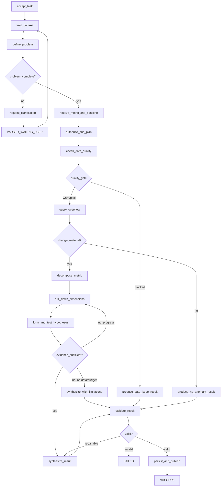

# 04. 受控 Agent 工作流

## 1. 设计目标

归因 Agent 不是一个无限自主的聊天循环，而是一个**可暂停、可恢复、可审计、受预算约束的状态机**。LLM 负责意图理解、候选假设和自然语言表达；指标解析、SQL 执行、数据质量、贡献计算、权限和结果校验由确定性组件完成。

核心原则：

1. **先定义问题，再查询数据**：指标、范围、当前期和基线未确定前不进入归因。
2. **先验证数据，再解释业务**：同步不完整、口径变化或重复数据会阻断业务归因。
3. **计划与执行分离**：模型产生受限计划，编排器只允许调用白名单工具。
4. **事实与叙述分离**：数值由工具生成，报告只能引用已登记证据。
5. **状态与依赖分离**：可序列化 State 用于检查点；连接和密钥只存在 Runtime Context。
6. **有界循环**：每个循环都有次数、成本、时间和“无进展”停止条件。

## 2. State 与 Runtime Context 分离

### 2.1 `AgentState`：可序列化业务状态

`AgentState` 必须符合 [`contracts/agent-state.schema.json`](../contracts/agent-state.schema.json)，只包含 JSON 可表达的数据：

- 任务和会话标识、当前节点、任务状态；
- 用户问题、标准化问题定义和澄清状态；
- 指标候选、选中指标版本和分析计划；
- 数据质量检查、观察、假设、证据和贡献；
- 工具调用摘要、查询/结果引用、预算计数；
- 错误、停止原因和最终结果引用。

不得放入 State：数据库连接、HTTP 客户端、文件句柄、模型实例、函数、生成器、访问令牌、明文密钥、未脱敏大结果集。每个成功节点结束后原子保存一个带 `state_version` 的检查点。

### 2.2 `RuntimeContext`：不可序列化运行依赖

```python
@dataclass(frozen=True)
class RuntimeContext:
    metric_registry: MetricRegistry
    query_service: ReadOnlyQueryService
    attribution_engine: AttributionEngine
    evidence_store: EvidenceStore
    checkpoint_store: CheckpointStore
    event_publisher: EventPublisher
    policy_engine: PolicyEngine
    llm: StructuredLLM
    clock: Clock
    config: RuntimeConfig
```

`RuntimeContext` 由依赖注入容器按任务创建；它不进入检查点。恢复任务时，根据 `tenant_id/user_id` 重新构造依赖并再次校验权限，不能沿用过期授权。

### 2.3 分离的价值

- 检查点可以安全写入数据库并跨进程恢复；
- 单元测试可替换任一依赖，不需要真实数据库或模型；
- 日志和导出中不会意外包含密钥；
- State Schema 升级可通过 `schema_version` 迁移；
- 同一状态可在开发环境重放，复现归因结果。

## 3. 总体状态机



## 4. 节点定义

| 节点 | 确定性/LLM | 输入 | 输出 | 失败策略 |
|---|---|---|---|---|
| `accept_task` | 确定性 | 用户消息、身份 | 初始 State、任务互斥锁 | 冲突返回 409/排队 |
| `load_context` | 确定性 | 会话、摘要、附件引用 | 有权限的上下文引用 | 附件未解析则记录缺失 |
| `define_problem` | LLM + 规则 | 问题和上下文 | `ProblemDefinition` 候选 | Schema 失败最多修复 1 次 |
| `request_clarification` | 确定性 | 歧义列表 | 澄清问题、暂停检查点 | 等待用户，不占 worker |
| `resolve_metric_and_baseline` | 检索 + 规则 | 指标文本、时间文本 | 指标版本、基线 | 多候选分差过小则澄清 |
| `authorize_and_plan` | 规则 + LLM | 权限、指标树、维度 | 白名单分析步骤 | 越权步骤直接拒绝 |
| `check_data_quality` | 确定性 | 数据水位、质量规则 | 质量检查和 gate | `block` 时禁止业务归因 |
| `query_overview` | 确定性 | QuerySpec | 当前/基线总值、变化 | 查询重试，禁止模型填值 |
| `decompose_metric` | 确定性 | 指标树、快照 | 指标分解贡献 | 不可分解则降级为观察 |
| `drill_down_dimensions` | 确定性 | 允许维度、预算 | 维度贡献排行 | 小样本合并为“其他” |
| `form_and_test_hypotheses` | LLM + 工具 | 异常切片、可用数据 | 假设状态、支持/反向证据 | 未执行工具不得支持假设 |
| `synthesize_result` | LLM | 已冻结事实包 | 结构化结果草稿 | 强制结构化输出 |
| `validate_result` | 确定性 | 草稿、证据、快照 | 校验报告或通过 | 数值不一致可修复 1 次 |
| `persist_and_publish` | 确定性 | 已校验结果 | 结果 ID、导出任务、事件 | 幂等写入 |

所有节点输入输出均通过 State 字段传递。节点不得隐式依赖上一节点的内存变量。

## 5. 关键路由条件

### 5.1 问题完整性

`problem_complete = true` 当且仅当：

- 指标唯一匹配且版本有效；
- 当前期已解析；
- 基线已由用户指定或规则显式选择；
- 过滤值能映射到唯一维度成员；
- 用户有权访问指标与分析范围。

否则生成最多 3 个短问题，并将任务置为 `waiting_user`。用户回复后创建新消息但恢复原任务上下文，`clarification_rounds` 增加。

### 5.2 数据质量门

质量检查结果分为：

- `pass`：可继续；
- `warn`：继续，但必须在结果限制中披露；
- `block`：数据水位不足、严重重复、当前/基线口径不一致等，输出数据问题结论，不做业务归因。

### 5.3 变化显著性

`change_material` 不等同于统计显著。默认同时考虑：

- 绝对变化是否超过指标阈值；
- 相对变化是否超过指标阈值；
- 样本量是否达到最小要求；
- 是否落在正常波动带之外。

未达到门槛时可输出“未发现需要归因的实质变化”，不应为满足用户预期强行生成原因。

### 5.4 证据充分性

`evidence_sufficient = true` 需要：

- 总体变化已由当前/基线快照确认；
- 至少一种合法分解能对账到总体变化；
- 主要结论存在直接证据且通过质量硬门槛；
- 前 N 个贡献项达到配置的覆盖率，或已说明长尾残差；
- 反向证据和缺失数据已检查；
- 结论等级不高于证据允许等级。

评分方法见 [05_attribution_methodology.md](./05_attribution_methodology.md)。

## 6. 分析循环与停止条件

循环只发生在 `drill_down_dimensions → form_and_test_hypotheses → evidence_sufficient`。默认预算建议：

| 预算 | 默认值 | 说明 |
|---|---:|---|
| `max_analysis_iterations` | 3 | 下钻/证据循环次数 |
| `max_tool_calls` | 20 | 单任务工具调用总数 |
| `max_sql_queries` | 12 | 可执行查询数 |
| `max_llm_calls` | 8 | 结构化模型调用数 |
| `max_wall_time_seconds` | 300 | 不含等待用户时间 |
| `max_rows_per_query` | 10000 | 明细查询硬限制 |
| `max_clarification_rounds` | 2 | 超过后带限制输出 |
| `min_new_evidence_per_iteration` | 1 | 判断是否取得进展 |

任一条件满足即停止循环：

1. 证据充分；
2. 达到任一预算上限；
3. 连续一轮没有新增证据或贡献覆盖率无提升；
4. 相同 `query_fingerprint` 已成功执行，禁止重复查询；
5. 所有剩余假设均因缺失数据不可验证；
6. 用户取消、权限撤销或运行截止时间到达；
7. 数据质量 gate 为 `block`。

因预算或数据不足停止时，任务仍可为 `success`，但结果必须标记 `partial`，列出未验证假设和停止原因。只有系统错误、契约错误且无法修复、持久化失败等才标记 `failed`。

## 7. 工具边界与契约

推荐白名单工具：

| 工具 | 输入 | 输出 |
|---|---|---|
| `resolve_metric` | 用户表达、TopK | 指标候选、版本、匹配分 |
| `resolve_dimension_value` | 文本、候选维度 | 规范成员 ID |
| `query_metric` | `QuerySpec` | 快照引用、聚合结果 |
| `check_data_quality` | 指标、周期、范围 | 质量检查列表和 gate |
| `decompose_additive` | 父指标、维度、两期 | 贡献列表、残差 |
| `decompose_product_shapley` | 因子、两期 | Shapley 贡献、残差 |
| `detect_anomaly` | 时间序列、策略 | 异常点、阈值、方法 |
| `search_attachment` | 查询、附件 ID | 引用片段，不返回任意路径 |
| `register_evidence` | 快照/片段、质量项 | 稳定 `evidence_id` |
| `render_report` | 通过校验的结果 ID | 导出文件引用 |

工具必须返回结构化结果和错误码，不把异常堆栈直接交给 LLM。SQL 工具仅接受受控 `QuerySpec` 或经 AST 校验的单条 `SELECT/CTE`，并强制只读账号、表白名单、参数绑定、超时、行数限制和租户条件。

## 8. 结果校验门

发布前执行以下确定性校验：

1. JSON 满足 [`analysis-result.schema.json`](../contracts/analysis-result.schema.json)；
2. 每个结论引用的 `evidence_id` 都真实存在且属于本任务；
3. 报告中的数值能在快照或贡献结果中找到，单位一致；
4. 加法/Shapley 贡献之和与总体变化之差不超过容差；
5. 结论强度不超过证据等级；`causal` 必须包含因果设计说明；
6. 质量 gate 为 `block` 时不得输出业务原因；
7. 不包含未授权维度、敏感明细、SQL/Prompt 注入内容；
8. 至少有两条下一步建议；建议不得自动执行高风险业务操作。

可修复的格式或措辞问题最多回到综合节点 1 次；数值、权限、血缘问题不得交给 LLM“修文案”绕过。

## 9. 检查点、幂等与恢复

- 检查点键：`task_id + state_version`；采用乐观锁防止重复 worker 覆盖。
- 每个工具调用使用 `idempotency_key = task_id + step_id + attempt`。
- State 先落检查点，再发布状态事件；事件带单调递增 `seq_no`，前端可去重。
- 查询结果以 `query_fingerprint` 缓存；相同指标版本、时间、范围和权限策略才可复用。
- worker 崩溃后从最后一个成功节点恢复；处于 `tool_running` 的调用先查询幂等记录，不盲目重放。
- 恢复时重新检查取消标记、权限、配置版本和数据快照有效期。

## 10. 实时事件

在既有 WebSocket 类型上，建议 `task_status.current_step` 使用稳定节点名；工具事件增加：

```json
{
  "event_type": "tool_finish",
  "task_id": "task-123",
  "seq_no": 17,
  "occurred_at": "2026-09-04T10:20:30+08:00",
  "tool_name": "decompose_additive",
  "step_id": "step-dimension-store",
  "status": "success",
  "tool_result_summary": "完成门店维度分解，前 5 项覆盖 81.2% 的下降量",
  "trace_id": "trace-456"
}
```

事件摘要不得包含连接串、原始 SQL 参数中的个人信息或大体量查询结果。

## 11. 故障分类

| 类型 | 示例 | 策略 |
|---|---|---|
| `transient` | 网络闪断、限流 | 指数退避，最多 2 次 |
| `data_quality` | 数据未同步、严重缺失 | 质量阻断结果，不重试业务分析 |
| `user_input` | 基线不明、筛选歧义 | 暂停并澄清 |
| `policy` | 越权数据、危险 SQL | 立即拒绝并审计 |
| `contract` | 模型输出不符合 Schema | 结构化修复 1 次，仍失败则终止 |
| `system` | 持久化故障、代码异常 | 任务失败，保存安全错误码 |

错误写入 State 时只保存错误码、可公开消息、节点、是否可重试和时间；完整堆栈只进受控服务日志。

## 12. 可观测性与评测

每轮任务至少记录：

- 全链路 `trace_id`、节点耗时、工具成功率和重试次数；
- 指标解析 Hit@1、字段/Join Key Recall、值映射准确率；
- 数据质量 gate 分布、贡献对账误差、证据覆盖率；
- SQL 可执行率、Execution Accuracy、纠错成功率；
- 总耗时/P95、SQL 与 LLM 调用数、Token 和单轮成本；
- 澄清率、部分结果率、取消率和用户采纳反馈。

日志中的 State 只能保存脱敏摘要。生产问题重放使用快照引用和内容哈希，不依赖已经变化的在线数据。

## 13. 节点实现约定

每个节点应满足相同接口：

```python
async def run_node(state: AgentState, ctx: RuntimeContext) -> NodeOutcome:
    """返回 state patch、route、events；不直接修改全局对象。"""
```

实现要求：

- 输入 State 视为不可变，返回最小 patch；
- 节点重复执行应幂等；
- route 只能来自枚举，禁止模型输出任意节点名；
- 工具输出先校验，再写入 State；
- 时间通过 `ctx.clock` 获取，便于测试；
- 每个路由、停止条件和异常分支都要有单元测试。
