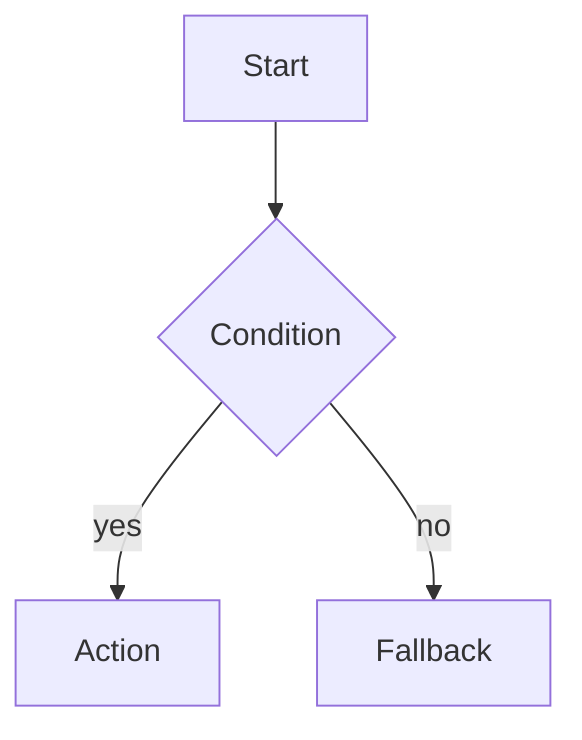

# FXXX — <功能名称>

> 本模板用于 Spec Coding：先把业务行为、边界、契约和验收方式写成可测试规格，再实现代码。删除所有尖括号占位文本后方可进入开发。

## 0. 元信息

| 字段 | 内容 |
|---|---|
| Spec ID | `FXXX` |
| 状态 | `Draft / Review / Approved / Implemented / Deprecated` |
| 负责人 | `<owner>` |
| 评审人 | `<product/data/backend/frontend/security>` |
| 创建/更新日期 | `<YYYY-MM-DD>` |
| 目标版本 | `<release>` |
| 依赖 Spec | `<links>` |
| 相关契约 | `<schema/api/event links>` |

状态门：只有 `Approved` 的 Spec 可以进入实现；行为变更先修改 Spec 和测试，再修改代码。

## 1. 背景与问题

### 1.1 当前问题

<谁在什么场景遇到什么可观察的问题？避免只写“需要新增某按钮”。>

### 1.2 业务价值

<用可量化结果描述：节省分析时间、提升正确率、缩短异常发现时间等。>

### 1.3 成功指标

| 指标 | 基线 | 目标 | 统计口径 | 数据来源 |
|---|---:|---:|---|---|
| `<metric>` | `<value>` | `<value>` | `<definition>` | `<source>` |

## 2. 目标与非目标

### 2.1 目标

- G1：<用户或系统能够完成的结果>
- G2：<可验证结果>

### 2.2 非目标

- NG1：<本期明确不解决的能力>
- NG2：<防止范围蔓延的边界>

## 3. 参与者、权限与前置条件

| 参与者 | 目标 | 权限 | 禁止行为 |
|---|---|---|---|
| `<role>` | `<goal>` | `<allowed>` | `<denied>` |

前置条件：

- <依赖服务、数据、配置或功能开关>
- <数据质量、指标版本或认证要求>

## 4. 术语与不变量

### 4.1 术语

| 术语 | 精确定义 | 反例/备注 |
|---|---|---|
| `<term>` | `<definition>` | `<note>` |

### 4.2 不变量

- INV-01：<在所有路径上都必须成立的约束>
- INV-02：<例如同一会话最多一个 running 任务>

## 5. 用户故事与场景

### US-01：<故事名称>

作为 `<角色>`，我希望 `<能力>`，从而 `<价值>`。

#### AC-01 正常路径

```gherkin
Given <可验证前置状态>
When <单一动作>
Then <可观察结果>
And <附加结果>
```

#### AC-02 边界/失败路径

```gherkin
Given <边界条件>
When <动作>
Then <明确错误码、状态或降级结果>
```

每条验收标准必须可由自动化测试或明确人工步骤验证，避免“体验良好”“足够智能”等模糊描述。

## 6. 功能需求

使用 `MUST / SHOULD / MAY` 表示强度。

- FR-01（MUST）：<一条原子、可测试需求>。
- FR-02（MUST）：<一条需求只描述一个主要行为>。
- FR-03（SHOULD）：<可降级但需要说明的行为>。

## 7. 工作流与状态机

### 7.1 状态

| 状态 | 进入条件 | 允许操作 | 退出条件 |
|---|---|---|---|
| `<state>` | `<condition>` | `<operations>` | `<condition>` |

### 7.2 流程



### 7.3 路由与停止条件

- R-01：<布尔条件> → `<next state/node>`
- STOP-01：<预算、取消、无进展、成功或失败条件>

所有循环必须指定次数、时间、成本和无进展上限。

## 8. 数据模型与契约

### 8.1 输入

```json
{}
```

### 8.2 输出

```json
{}
```

### 8.3 持久化变更

| 表/对象 | 字段 | 类型 | 约束 | 迁移/回滚 |
|---|---|---|---|---|
| `<table>` | `<field>` | `<type>` | `<constraint>` | `<plan>` |

### 8.4 版本兼容

- Schema/API/Event 版本：`<version>`
- 向后兼容策略：<读取旧版本、双写、迁移期限>
- 幂等键：<定义>

## 9. API 与实时事件

### 9.1 API

| Method | Path | 权限 | Request | Response | 错误码 |
|---|---|---|---|---|---|
| `<method>` | `<path>` | `<scope>` | `<schema>` | `<schema>` | `<codes>` |

### 9.2 事件

| 事件 | 触发时机 | 必填字段 | 顺序/去重规则 |
|---|---|---|---|
| `<event_type>` | `<when>` | `<fields>` | `<seq/idempotency>` |

## 10. 依赖与工具边界

| 依赖/工具 | 用途 | 超时 | 重试 | 降级 | 安全限制 |
|---|---|---:|---:|---|---|
| `<tool>` | `<purpose>` | `<seconds>` | `<count>` | `<fallback>` | `<policy>` |

明确哪些决定由规则/代码完成，哪些可由 LLM 建议；不得让 LLM 绕过权限、数据质量或结果校验。

## 11. 错误处理、幂等与恢复

| 失败类型 | 示例 | 用户可见行为 | 系统行为 | 可重试 |
|---|---|---|---|---:|
| `<category>` | `<example>` | `<message>` | `<action>` | `<yes/no>` |

- 检查点：<保存时机、版本锁>
- 幂等：<请求、任务、工具调用、事件的幂等键>
- 恢复：<崩溃/重启后从何处继续>
- 取消：<轮询点、正在执行工具如何终止>

## 12. 安全、隐私与合规

- 身份与授权：<租户/行列级权限如何传递>
- 输入安全：<Prompt 注入、文件路径、SQL AST 校验>
- 输出安全：<脱敏、最小披露、下载鉴权>
- 凭据：<仅 Runtime Context，禁止进入 State/日志>
- 审计：<谁在何时访问了什么数据和生成了什么结果>
- 保留与删除：<会话删除和数据生命周期>

## 13. 非功能需求

| ID | 类别 | 要求 | 测量方法 |
|---|---|---|---|
| NFR-01 | 性能 | `<P95/timeout>` | `<load test>` |
| NFR-02 | 可用性 | `<SLO>` | `<monitor>` |
| NFR-03 | 成本 | `<budget>` | `<telemetry>` |
| NFR-04 | 可观测性 | `<trace/log/metric>` | `<dashboard>` |

## 14. 可观测性

- 日志：<结构化字段、脱敏规则>
- 指标：<成功率、耗时、质量、成本>
- Trace：<跨 API、任务、工具的 trace_id>
- 告警：<阈值、接收者和处理手册>

## 15. 测试与验收计划

| 测试 ID | 覆盖需求 | 层级 | 数据/前置条件 | 预期 |
|---|---|---|---|---|
| T-01 | FR-01, AC-01 | unit | `<fixture>` | `<assertion>` |

至少包含：正常路径、边界值、权限、注入、超时/重试、幂等、取消、恢复、Schema 契约、并发、数据质量和回归测试。

### 15.1 Golden Dataset / Eval（涉及 AI 时）

- 数据集版本：<固定问题、标准证据/SQL/结果>
- 离线指标：<检索、执行正确率、证据一致性>
- 通过门槛：<相对于基线不得退化>
- 人工评审：<抽样、双人标注、分歧处理>

## 16. 发布、迁移与回滚

1. <数据库/Schema 迁移>
2. <Feature Flag 和灰度比例>
3. <影子流量或双跑比较>
4. <监控窗口和回滚阈值>
5. <回滚步骤及数据兼容>

## 17. 风险、假设与待决策

| ID | 类型 | 描述 | 影响 | 负责人 | 截止日期/决策 |
|---|---|---|---|---|---|
| RISK-01 | 风险 | `<risk>` | `<impact>` | `<owner>` | `<mitigation>` |

## 18. 需求追踪矩阵

| 需求 | 验收标准 | 契约/API | 实现模块 | 测试 |
|---|---|---|---|---|
| FR-01 | AC-01 | `<schema>` | `<module>` | T-01 |

任何 `MUST` 需求都必须映射到至少一个测试。

## 19. Definition of Done

- [ ] 产品、数据、研发和安全评审已通过，Spec 状态为 `Approved`。
- [ ] 所有 `MUST` 需求和验收标准已有自动化测试并通过。
- [ ] 契约通过 JSON Schema/OpenAPI/Event 校验，示例数据可解析。
- [ ] 权限、注入、敏感数据、超时、幂等、取消与恢复路径已验证。
- [ ] 可观测性、告警、运行手册和回滚步骤已就绪。
- [ ] 文档、配置、迁移和 Golden Dataset 已版本化。
- [ ] 灰度指标达到门槛且无阻断级缺陷。

## 20. 变更记录

| 日期 | 版本 | 变更 | 作者 | 评审结果 |
|---|---|---|---|---|
| `<date>` | `<version>` | `<change>` | `<author>` | `<result>` |
